# Trackster Taka — Netrunner

Unofficial companion for the [Netrunner LCG](https://nullsignal.games/) — track credits, clicks, tags, agenda points, core damage, bad publicity, MU, hand size, and link in a single tap-first screen. Same idea as the MTG life trackers that have circulated for years, only purpose-built for Netrunner. Built with React Native + Expo (TypeScript). Runs in the browser, on Android, and on iOS.

**[Try it in your browser →](https://salvob41.github.io/trackster-taka/)**

## Tour

The tracker has two play modes — **Both** (Corp and Runner on one device) and **Solo** (just your side) — and adapts to **portrait** or **landscape** automatically. Below is one panel per screen, showing how each mode looks in each orientation.

### Setup

Pick the side(s) you want to track and the matching faction(s). Each faction tile glows in its own color when selected; **START GAME** unlocks once your selection is valid. The mode toggle (`BOTH` / `CORP` / `RUNNER`) at the top decides whether you'll see one panel or two during the game.

| Portrait | Landscape |
| --- | --- |
| 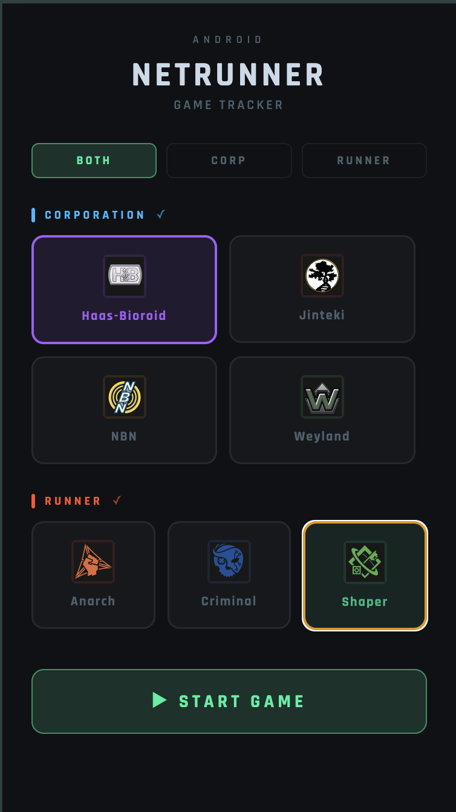 | 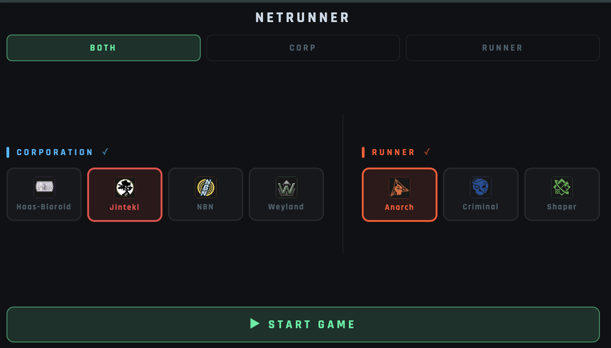 |

### Both mode — Corp and Runner on one device

The full two-sided tracker. Each side shows clicks (top), a split-tap credit counter (`–` left half subtracts, `+` right half adds), faction-specific stat chips, and a **+ click** button that cycles an extra-click counter (0→1→2→3) for cards like *Bankhar* or *Beth Kilrain-Chang*. The **`↑↓` flip button** rotates that side's panel 180° so the player across the table reads it right-side up. The shared **agenda bar** is the tug-of-war between the two scores: Corp fills from one end, Runner from the other, first to 7 wins.

- **Portrait** stacks Corp on top of Runner with a horizontal agenda bar between them.
- **Landscape** splits them left/right with a vertical agenda bar centered between the panels.

| Portrait | Landscape |
| --- | --- |
| 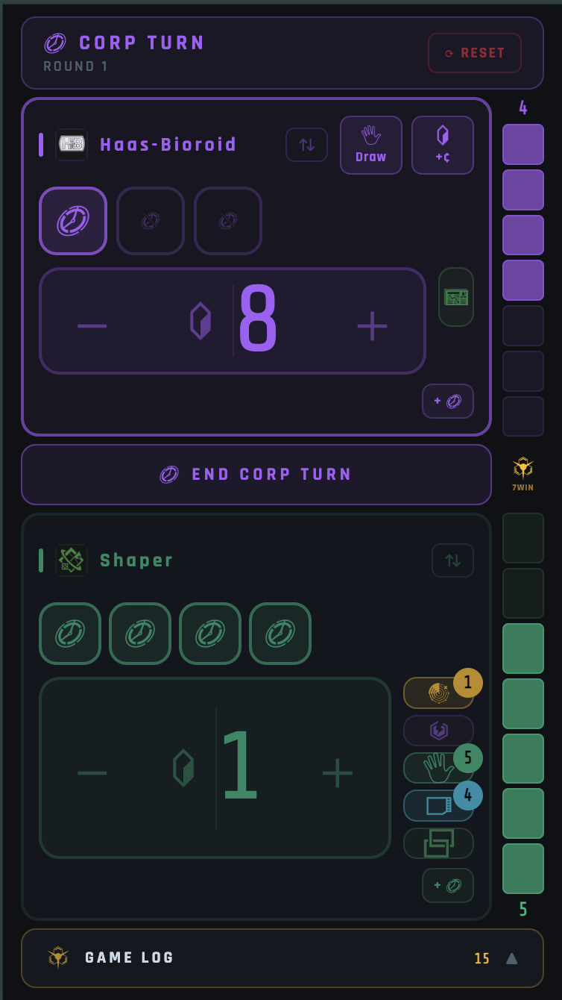 | 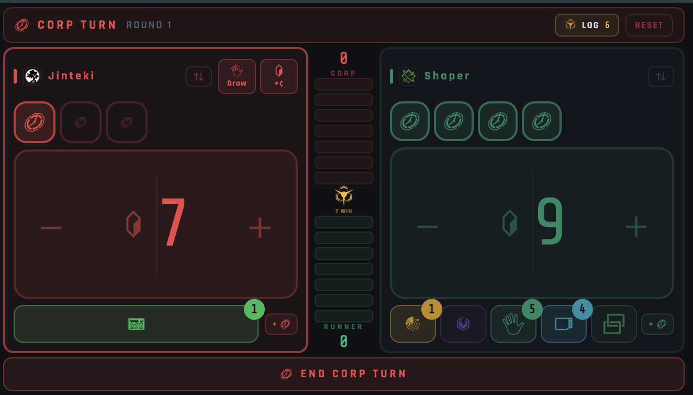 |

### Solo mode — track only your side

If you're playing across the table from a human opponent, pick one side at setup. The opposing score is entered manually via the `OPP` chip in the header so the agenda bar still works. Stat chips on the side rail (tags, core damage, hand size, MU, link, bad publicity) expand on tap so the less-used counters stay out of the way.

| Solo Corp — portrait | Solo Runner — portrait |
| --- | --- |
| 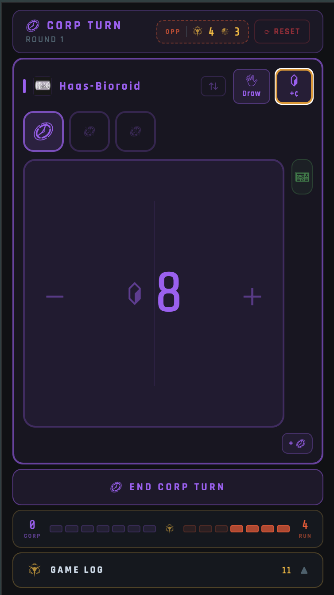 | 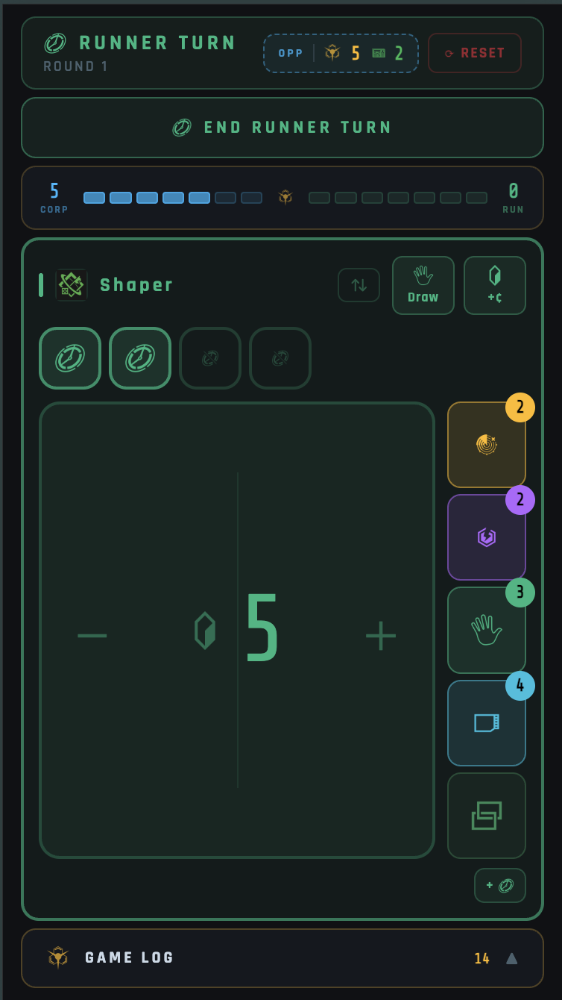 |

| Solo Corp — landscape | Solo Runner — landscape |
| --- | --- |
| 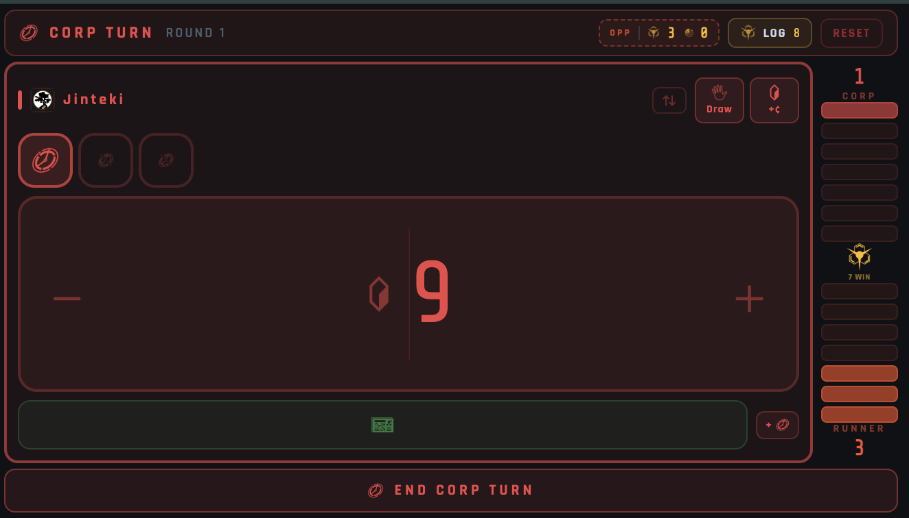 | 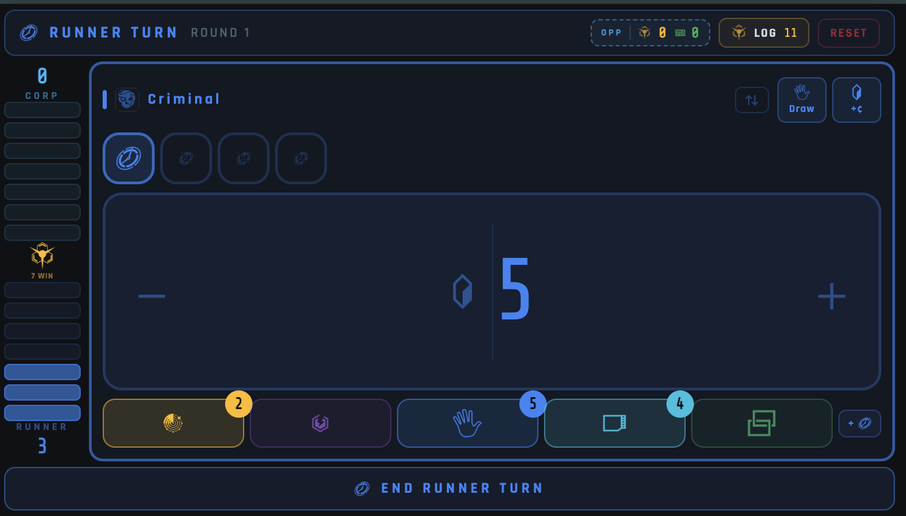 |

### Game log

Every action — clicks spent, credits taken, cards drawn, agendas scored or stolen, turn transitions — is recorded with its round number and side. Tap **GAME LOG** at the bottom (portrait) or the **LOG** chip in the header (landscape) to slide up the full history.

| Portrait | Landscape |
| --- | --- |
| 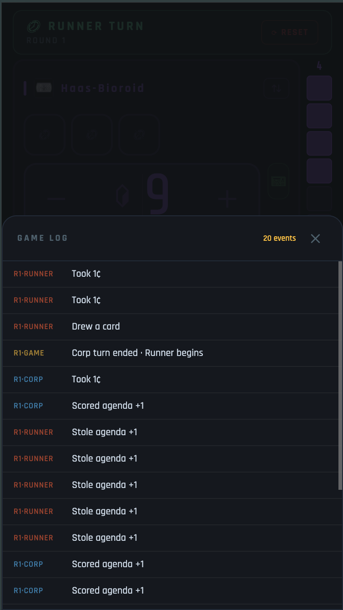 | 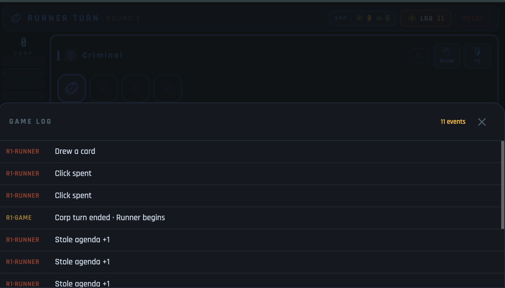 |

### Win overlay

When either side reaches 7 agenda points, a win overlay covers the board with the winning faction and a **NEW GAME** button to reset.

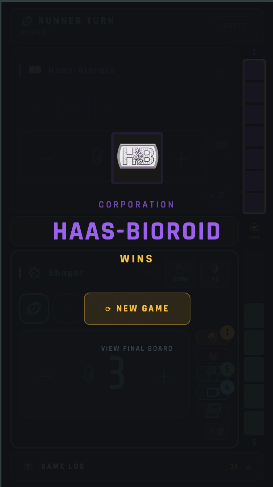

## Why

Netrunner has a lot of state to track per side: clicks, credits, agenda points, tags, damage, hand size, MU, link, bad pub. This keeps it all on one screen so you can stay in the game.

## Run locally

```bash
npm install
npm run web    # browser
npm start      # Metro — scan the QR with Expo Go for Android/iOS
```

## Build

```bash
# Android APK (needs Android SDK + JDK 17)
npx expo prebuild --platform android
cd android && ./gradlew assembleRelease

# Web static site
npx expo export --platform web   # → dist/
```

For consistent Android signing across CI builds, set `ANDROID_KEYSTORE_B64`, `ANDROID_KEYSTORE_PASSWORD`, `ANDROID_KEY_ALIAS`, and `ANDROID_KEY_PASSWORD` as repo secrets — `.github/workflows/build-apk.yml` picks them up.

## Releasing

Tag `vX.Y.Z` to ship: APK release via `build-apk.yml`, web deploy to Pages on push to `main`.

## Code layout

```
src/
├── App.tsx                 # entry, orientation routing
├── theme.ts                # colors, factions
├── state.ts                # game state + rules
├── hooks/                  # useGameState, useBatchedDelta
├── screens/                # SetupScreen, GameScreen, GameScreenLandscape
└── components/             # CreditCounter, ClickToken, StatChip, AgendaBar, …
```

State lives in `state.ts` with no React imports — screens map state to widgets and call handlers, they don't make rule decisions.

## Credits

- Game: [Null Signal Games](https://nullsignal.games/) (formerly NISEI / FFG)
- Icons: [NSG Visual Assets](https://nullsignal.games/about/resources/)
- Hand icon: [Kalashnyk on Flaticon](https://www.flaticon.com/free-icon/five_9437501)
- App icon: [Fox animated icons created by Freepik - Flaticon](https://www.flaticon.com/free-animated-icons/fox)
- Android adaptive icon stack (foreground / background / monochrome) generated with [Icon Kitchen](https://icon.kitchen/)
- Built with [Expo](https://expo.dev/) + [React Native](https://reactnative.dev/)

## License

Code is licensed under the **Apache License 2.0** — see [LICENSE](./LICENSE)
and [NOTICE.md](./NOTICE.md).

Bundled third-party assets are **not** covered by Apache-2.0 and keep their own
licenses: Null Signal Games icons under CC BY-ND 4.0, and the Flaticon icons
(hand, fox app icon) under the Flaticon license. See [NOTICE.md](./NOTICE.md)
for full attributions.

Unofficial fan project — not affiliated with or endorsed by Null Signal Games,
Fantasy Flight Games, or Wizards of the Coast. *Android: Netrunner* and related
marks are trademarks of their respective owners.
