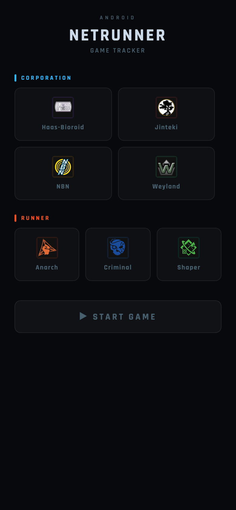
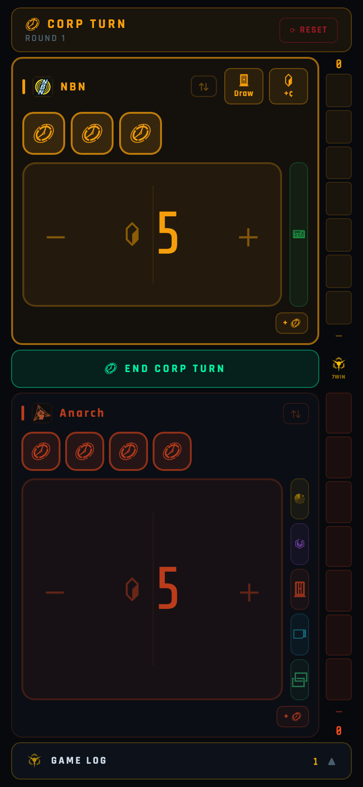
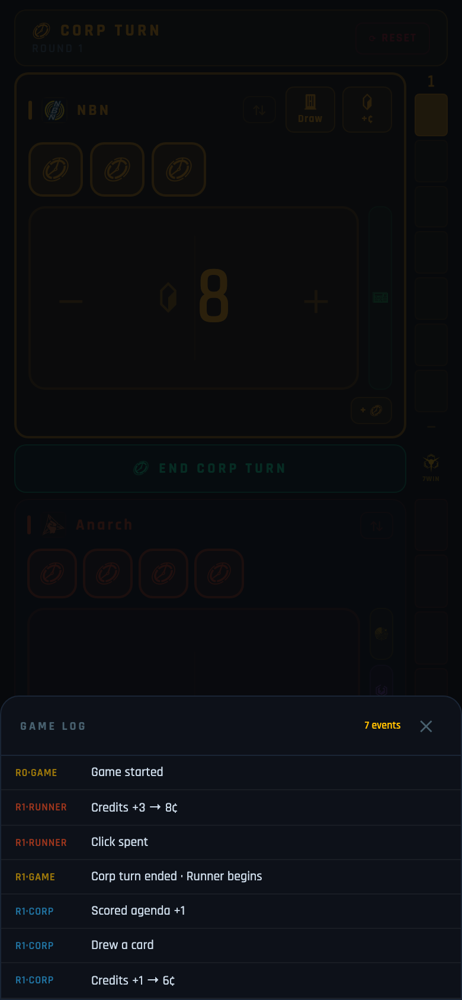

# Netrunner Game Tracker

A single-screen game state tracker for [Android: Netrunner](https://nullsignal.games/), designed for fast, tap-first interaction during live play. Built with **React Native + Expo** (SDK 52, TypeScript) — runs on Android, web, and iOS.

**[Try it in your browser](https://salvob41.github.io/netrunner-tracker-app/)**

## Screenshots

| Faction picker | Game screen | Game log |
| --- | --- | --- |
|  |  |  |

## Why this exists

Netrunner has a lot of game state to track: clicks, credits, agenda points, tags, core damage, hand size, bad publicity, memory units, link strength — across two asymmetric factions. Pen and paper works, but it's easy to lose track during a tense run. This tracker keeps everything visible on one screen with a tap-to-adjust interface that stays out of the way.

## Features

- **Faction setup screen** — pick Corp (HB, Jinteki, NBN, Weyland) and Runner (Anarch, Criminal, Shaper) with official NSG faction glyphs; each faction has its own color theme
- **One-screen layout** — Corp and Runner panels always visible, no scrolling; active panel glows, inactive dims at 72% opacity
- **Giant split-tap credit counter** — fills the panel; left half = −1, right half = +1; number pops with scale animation on change; batched delta pill shows uncommitted changes
- **Click tokens** — tap to spend, tap spent token to restore; extra clicks appear as smaller ghost tokens
- **StatChip** — collapsed icon-only view, tap to expand into −/value/+ controls; covers tags, core damage, hand size, MU, link, bad pub
- **Panel flip button** — rotate either panel 180° for across-table play
- **Extra click button** — cycle extra temporary clicks (0→1→2→3→0); ghost tokens auto-fill and reset on end turn
- **Agenda tug-of-war** — vertical 7-segment sidebar; Corp fills from top, Runner fills from bottom; first to 7 AP wins
- **End Turn button** — transitions turn and resets temporary clicks; Draw and +¢ action buttons consume a click inline
- **Game log** — slide-up sheet with full color-coded event history, newest first
- **Win overlay** — faction glyph, name, and NEW GAME button
- **Official iconography** — [Null Signal Games](https://nullsignal.games/) PNG assets, tinted per-faction at runtime via `tintColor`

## Running locally

```bash
npm install

# Web (browser)
npm run web

# Start Metro (then scan QR for Expo Go on Android/iOS)
npm start
```

## Building

```bash
# Android APK (requires Android SDK + JDK 17)
npx expo prebuild --platform android
cd android && ./gradlew assembleRelease

# Web static site
npx expo export --platform web   # → dist/
```

### Android: "package conflicts with an existing package"

Android only lets you update an app in place if the new APK is signed with the **same key** as the one already installed. By default, each CI run uses a fresh debug key — to get consistent signing across releases, add these GitHub Actions secrets:

| Secret | Value |
| --- | --- |
| `ANDROID_KEYSTORE_B64` | Base64 of your `.jks` upload keystore |
| `ANDROID_KEYSTORE_PASSWORD` | Keystore password |
| `ANDROID_KEY_ALIAS` | Key alias (usually `upload`) |
| `ANDROID_KEY_PASSWORD` | Key password (omit if same as store password) |

The workflow in `.github/workflows/build-apk.yml` picks these up automatically.

## Architecture

```
src/
├── App.tsx                  # Entry point: font loading, setup→game state machine
├── theme.ts                 # Colors, faction definitions, atmosphere presets
├── state.ts                 # Pure game state types and initial state factory
├── screens/
│   ├── SetupScreen.tsx      # Faction picker UI
│   └── GameScreen.tsx       # Full game tracker UI and state handlers
└── components/
    ├── CreditCounter.tsx    # Giant split-tap credit panel with batched delta
    ├── ClickToken.tsx       # Animated spend/restore click token (ghost variant)
    ├── StatChip.tsx         # Collapsible icon→expanded stat adjuster (flexHeight mode)
    ├── AgendaBar.tsx        # Vertical 7-segment agenda tug-of-war
    ├── FactionGlyph.tsx     # Circular faction badge with official NSG PNG
    ├── Icon.tsx             # NSG PNG icon with runtime tintColor
    ├── LogSheet.tsx         # Slide-up color-coded event history sheet
    └── WinOverlay.tsx       # Full-screen win announcement
```

State is fully decoupled from UI — `state.ts` has no React imports and encodes all game rules (click counts, win threshold, turn structure). Screen components never make rule decisions; they only map state to widgets and call handlers.

## CI/CD

**Versioning (SemVer):** bump `patch` for bugfixes, `minor` for new user-visible behavior, `major` for rewrites. Tag `vX.Y.Z` to ship.

GitHub Actions triggers:

| Trigger | Workflow | Output |
| --- | --- | --- |
| Push tag `v*` | `build-apk.yml` | Android APK artifact + GitHub Release |
| Push to `main` | `deploy-web.yml` | Static site → GitHub Pages |

## Credits

- Game design: [Null Signal Games](https://nullsignal.games/) (formerly NISEI / Fantasy Flight Games)
- Icons: [NSG Visual Assets](https://nullsignal.games/about/resources/)
- Built with: [Expo](https://expo.dev/) + [React Native](https://reactnative.dev/)

## License

Fan-made utility. Android: Netrunner is a trademark of Fantasy Flight Games / Null Signal Games.
