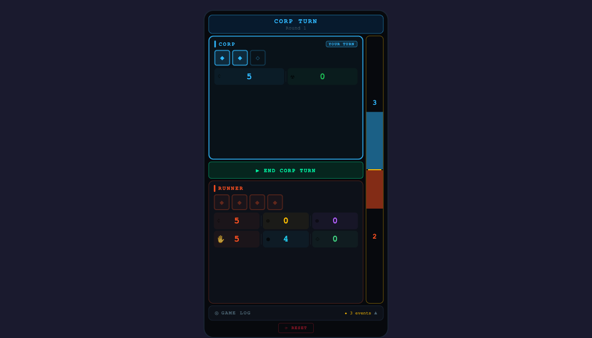

# Netrunner Game Tracker

A single-screen game state tracker for [Android: Netrunner](https://nullsignal.games/), designed for fast, tap-first interaction during live play. Built with [Flet](https://flet.dev/) (Flutter for Python) — runs everywhere from a phone in your hand to a browser tab on your laptop.

**[Try it in your browser](https://salvob41.github.io/netrunner-tracker-app/)**

## Screenshots



## Why this exists

Netrunner has a lot of game state to track: clicks, credits, agenda points, tags, core damage, hand size, bad publicity, memory units, link strength — across two asymmetric factions. Pen and paper works, but it's easy to lose track during a tense run. This tracker keeps everything visible on one screen with a tap-to-adjust interface that stays out of the way.

## Features

- **One-screen layout** — Both Corp and Runner panels always visible, no scrolling during play
- **Split-tap stats** — Tap the right half of any stat to +1, left half to -1. No fiddly buttons
- **Debounced logging** — Rapid taps batch into a single log entry (1.2s for credits, 0.8s for others) with live +N/-N delta badges
- **Click tokens** — Tap filled tokens to spend, tap spent tokens to restore
- **Agenda tug-of-war** — Vertical sidebar bar where Corp fills upward and Runner fills downward from a center divider
- **Faction theming** — Corp in electric blue, Runner in molten orange, agenda in gold. Active player's panel glows
- **Game log** — Collapsible event history with NSG icons, newest events first
- **Official iconography** — [Null Signal Games](https://nullsignal.games/) PNG assets, tinted per-faction at runtime
- **Cross-platform** — Android (APK), web (GitHub Pages), macOS, Windows, Linux

## Running locally

```bash
pip install flet

# Desktop app
flet run src/main.py

# Web app (opens browser)
cd src && python -c "
import flet as ft
from tracker import NetrunnerTracker
def main(page): NetrunnerTracker(page)
ft.run(main, assets_dir='assets', view=ft.AppView.WEB_BROWSER, port=8550)
"
```

## Building

```bash
flet build apk     # Android APK → build/apk/
flet build web     # Static web → build/web/
flet build macos   # macOS app
```

## Architecture

```
src/
├── main.py          # Entry point (5 lines)
├── state.py         # Pure game state — zero UI imports, fully testable
├── tracker.py       # Controller — wires state to widgets, handles events
├── components.py    # Stateless UI primitives (split_tap_stat, agenda_bar, etc.)
├── theme.py         # All colors, icons, symbols in one place
├── game_log.py      # Append-only event log (80 entries max)
└── assets/          # NSG PNG icons (tinted at runtime via SRC_IN blend)
```

State is fully decoupled from UI — `state.py` has no Flet imports and encodes all game rules (click counts, win threshold, turn structure). The controller never makes rule decisions; it just maps state to widgets.

## CI/CD

GitHub Actions on push to `main`:

- **Build APK** — builds Android APK, uploads as artifact
- **Deploy Web** — builds static site and deploys to GitHub Pages

## Credits

- Game design: [Null Signal Games](https://nullsignal.games/) (formerly NISEI / Fantasy Flight Games)
- Icons: [NSG Visual Assets](https://nullsignal.games/about/resources/)
- Built with: [Flet](https://flet.dev/)

## License

Fan-made utility. Android: Netrunner is a trademark of Fantasy Flight Games / Null Signal Games.
