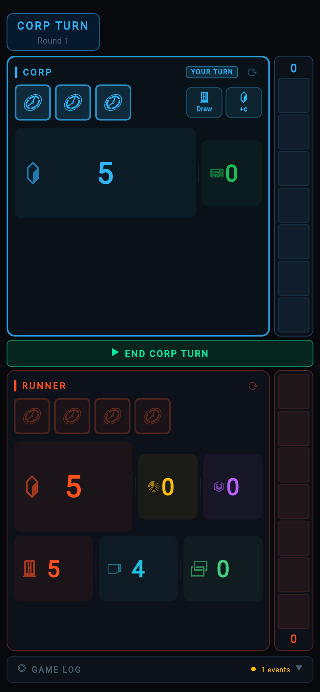
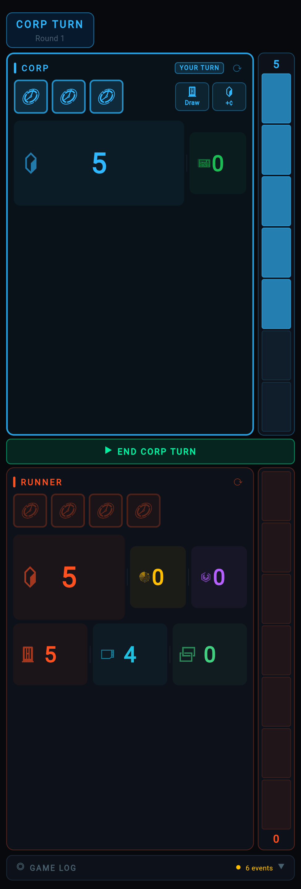
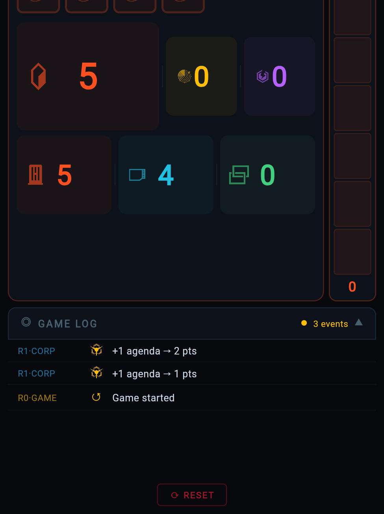
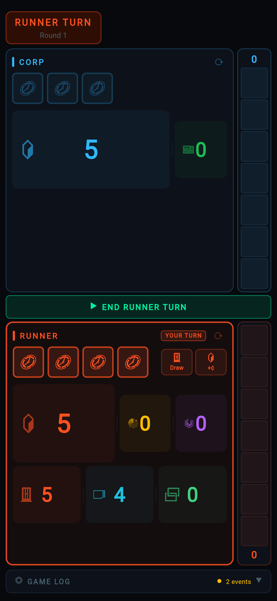

# Netrunner Game Tracker

A single-screen game state tracker for [Android: Netrunner](https://nullsignal.games/), designed for fast, tap-first interaction during live play. Built with [Flet](https://flet.dev/) (Flutter for Python) — runs everywhere from a phone in your hand to a browser tab on your laptop.

**[Try it in your browser](https://salvob41.github.io/netrunner-tracker-app/)**

## Screenshots (mobile)

Phone-width viewport. Start and agenda pips, then a **cropped** full-width strip so log lines are readable, and Runner turn (banner, YOUR TURN, **END RUNNER TURN**).

| Start of match (Corp) | Agenda scoring (sidebar) |
| --- | --- |
|  |  |
| **Game log** (open, showing lines) | **Runner turn** (active panel) |
|  |  |

## Why this exists

Netrunner has a lot of game state to track: clicks, credits, agenda points, tags, core damage, hand size, bad publicity, memory units, link strength — across two asymmetric factions. Pen and paper works, but it's easy to lose track during a tense run. This tracker keeps everything visible on one screen with a tap-to-adjust interface that stays out of the way.

## Features

- **One-screen layout** — Both Corp and Runner panels always visible, no scrolling during play
- **Split-tap stats** — Left half of a stat = −1, right half = +1 (separate `on_tap_down` zones; no position math, which is unreliable in Flet when `width` is missing in events)
- **Debounced logging** — Rapid credit tweaks batch into one log line after you pause (~1s for credits, 0.8s for other stats) with a live +N/−N delta badge while you are adjusting
- **Click tokens** — Tap filled tokens to spend, tap spent tokens to restore; **allotted** extra clicks from effects appear as ghosted, softer filled chips after your normal 3/4
- **Agenda tug-of-war** — Vertical sidebar bar where Corp fills upward and Runner fills downward from a center divider
- **Faction theming** — Corp in electric blue, Runner in molten orange, agenda in gold. Active player's panel glows
- **Game log** — Collapsible event history with NSG icons, newest events first
- **Official iconography** — [Null Signal Games](https://nullsignal.games/) PNG assets, tinted per-faction at runtime
- **Cross-platform** — Android (APK), web (GitHub Pages), macOS, Windows, Linux

## Running locally

```bash
python3 -m venv .venv && source .venv/bin/activate   # optional
pip install flet

# Desktop app
flet run src/main.py

# Web (browser)
cd src && python -c "
import flet as ft
from tracker import NetrunnerTracker
def main(page): NetrunnerTracker(page)
ft.run(main, assets_dir='assets', view=ft.AppView.WEB_BROWSER, port=8550)
"
```

## Building

```bash
flet build apk     # Android APK → build/apk/
flet build web     # Static web → build/web/
flet build macos   # macOS app
```

### Android: “package conflicts with an existing package”

Android only lets you **update** an app in place if the new APK is signed with the **same key** as the one already on the device. The GitHub Action release APKs are, by default, signed with a **one-off** key per CI run, and a local `flet build apk` is signed differently again — the **app id** is the same, but the **signatures** do not match, and the installer refuses with that error (or *App not installed*).

**Fix right now:** uninstall **Netrunner Tracker** (or the previous install) from the phone, then install the new APK. You are not in a “Play Store” upgrade path; it is a fresh install of the new build.

**For future releases that update in place** without uninstalling, use one **upload keystore** for every build and [configure it for Flet](https://flet.dev/docs/publish/android/) (see [environment variables](https://flet.dev/docs/reference/environment-variables) such as `FLET_ANDROID_SIGNING_KEY_STORE`, etc.). In this repository you can add GitHub **Actions secrets** so CI signs release APKs consistently: `ANDROID_KEYSTORE_B64` (base64 of your `.jks` file), `ANDROID_KEYSTORE_PASSWORD`, optionally `ANDROID_KEY_PASSWORD`, and `ANDROID_KEY_ALIAS` (often `upload`). The workflow in `.github/workflows/build-apk.yml` reads those when set.

## Architecture

```
src/
├── main.py          # Entry point (5 lines)
├── state.py         # Pure game state — zero UI imports, fully testable
├── tracker.py       # Controller — wires state to widgets, handles events
├── components.py    # Stateless UI primitives (split_tap_stat, agenda_bar, etc.)
├── theme.py         # All colors, icons, symbols in one place
├── game_log.py      # Append-only event log (80 entries max)
└── assets/          # NSG PNG icons (tinted at runtime via SRC_IN blend)
```

State is fully decoupled from UI — `state.py` has no Flet imports and encodes all game rules (click counts, win threshold, turn structure). The controller never makes rule decisions; it just maps state to widgets.

## CI/CD

**Versioning (SemVer):** bump the **patch** `z` in `1.x.z` for bugfixes and small UI tweaks; bump **minor** `y` for user-visible new behavior. This repo’s `pyproject.toml` `version` should follow that, then **tag** `v1.x.z` to ship.

GitHub Actions on push to `main`:

- **Build APK** — builds Android APK, uploads as artifact
- **Deploy Web** — builds static site and deploys to GitHub Pages

## Credits

- Game design: [Null Signal Games](https://nullsignal.games/) (formerly NISEI / Fantasy Flight Games)
- Icons: [NSG Visual Assets](https://nullsignal.games/about/resources/)
- Built with: [Flet](https://flet.dev/)

## License

Fan-made utility. Android: Netrunner is a trademark of Fantasy Flight Games / Null Signal Games.
